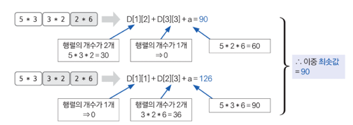

## 행렬 곱셈 순서
### 난이도: gold 3

### 점화식 정의

```aiignore
D[1][N - 1] + D[N][N] + a // 1개의 행렬로 합치는 데 드는 횟수
```




### 손으로 풀어보기
행렬 구간에 행렬이 1개일 때 0을 리턴합니다. 행렬 구간에 행렬이 2개일 때 '앞 행렬의 row 값 * 뒤 행렬의 row값 * 뒤 행렬의 column값'을 리턴합니다. 행렬 구간이 3개 이상일 때는 다음 조건식의 결괏값을 리턴합니다.

행렬 구간에 행렬이 3개 이상일 때 조건식
```java
// s: 시작 인덱스 e: 종료 인덱스
min = Math.min(min, D[s][i] + D[i + 1][e] + a(s 행렬의 row * i + 1 행렬의 row * e 행렬의 column))
```

