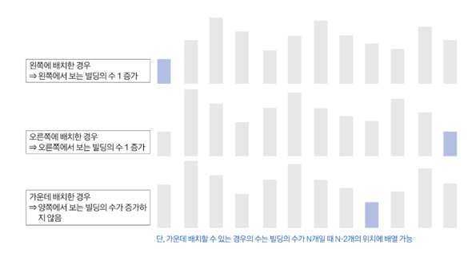

## 문제 분석
### 점화식 정의
D[N][L][R]: N개의 빌딩이 있고 왼쪽에서 L개, 오른쪽에서 R개가 보일 때 가능한 경우의 수

N - 1개 빌딩과 관련된 모든 경우의 수를 알고 있다고 가정해 보겠습니다. 그러면 이후 1개의 빌딩을 1개의 빌딩을 어느 곳에 배치할 것인지 결정하는 것이 관건인데요. 이때 배치하는 빌딩이 가장 크다면 가장 왼쪽이나 오른쪽에 배치할 때 보이는 빌딩의 수는 1개가 될 것입니다. 하지만 중간에 배치하면 어떤 수가 나올지 예상하기 어렵습니다.

이 시점에 1가지 관점을 다르게 해 볼 수 있습니다. '높이가 애매한 빌딩을 마지막에 배치하는 것이 아니라 일정한 규칙에 따라 배치해 단순화해 볼 수 있지 않을까?'라는 가정을 더해봅힙다. 

앞서 가장 큰 빌딩을 마지막에 배치하면 중간에 배치했을 때의 경우가 복잡하므로 이와 반대로 가장 작은 빌딩을 N번째로 배치한다고 가정해 보겠습니다. 그러면 명확하게 다음과 같이 3가지 경우의 수가 발생합니다.




이 3가지 경우의 수를 바탕으로 점화식을 도출해 보겠습니다.

## 손으로 풀어보기
1. 상황에 따른 점화식을 구합니다. 먼저 N개의 빌딩이 왼쪽에 L개, 오른쪽에 R개가 보인다고 가정하면 N - 1개의 빌딩에서 왼쪽에 빌딩을 추가할 때 왼쪽 빌딩이 1개 증가하므로 이전 경우의 수는 다음과 같습니다.
```aiignore
D[N - 1][L - 1][R]
```

N - 1개의 빌딩에서 오른쪽에 빌딩을 추가할 때 오른쪽 빌딩이 1개 증가하므로 이전 경우의 수는 다음과 같습니다.

(i-2)를 곱하는 이유: 새 빌딩을 놓을 수 있는 위치가 i-2개이기 때문입니다 (맨 왼쪽과 맨 오른쪽을 제외한 모든 위치).
```aiignore
D[N - 1][L][R - 1]
```

N - 1개의 빌딩에서 가운데 빌딩을 추가할 때는 증가 수가 없지만, N - 2개의 위치에 배치할 수 있으므로 N - 2를 곱합니다.
```aiignore
D[N - 1][L][R] * (N - 2)
```

3가지 경우의 수를 모두 더하면 다음과 같은 점화식이 나옵니다.
```aiignore
D[N][L][R] = D[N - 1][L - 1][R] + D[N - 1][L][R - 1] + D[N - 1][L][R] * (N - 2)
```

