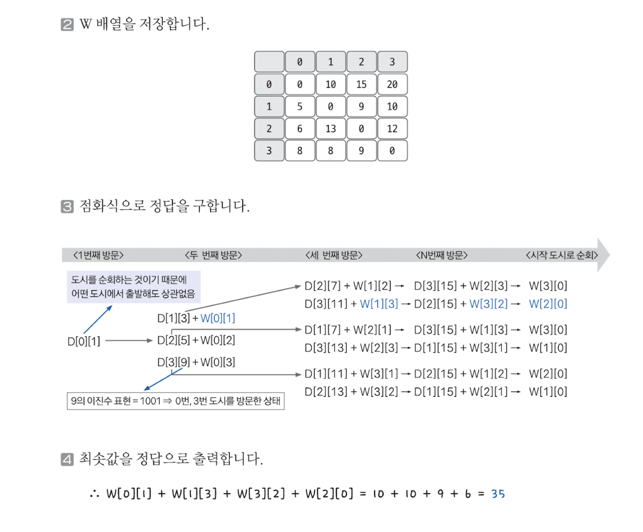

## 1. 문제 분석하기

점화식 정의
```aiignore
D[c][v]: 현재 도시가 c, 현재까지 방문한 모든 도시 리스트가 v일 때 앞으로 남은 모든 도시를 경유하는 데 필요한 최소 비용
```

총 도시가 4개일 때를 예로 들어 방문 도시를 이진수로 표현해 보겠습니다. 방문 도시를 이진수의 각 자릿수를 표현하고, 방문 시 1, 미방문 시 0의 값으로 저장합니다.

- 4, 1번 방문 -> 이진수로 표현(1001) -> D[i][9]
- 3번, 2번 방문 -> 이진수로 표현(110) -> D[i][6]
- 4번, 3번, 2번, 1번 방문 -> 이진수로 표현(1111) -> D[i][15]

## 2. 손으로 풀어보기
```aiignore
D[c][v] = Math.min(D[c][v], D[i][v | (1 << i)] + W[c][i]
```

### 점화식에 사용한 비트 연산식

모든 도시 순회 판단 연산식
```aiignore
if (v == (1 << N) -1)
// 예) N = 4(도시의 개수가 4개인 경우): (1 << 4) - 1 = 15
```

방문 도시 확인 연삭식
```aiignore
if ((v & (1 << i)) == 0)
// 예) i = 3 (4번째 도시 확인 여부 확인): 1 <<3 = 8 = 1000
```

방문 도시 저장 연산식
```aiignore
v | (1 << i)
// 예) i = 2 (2번째 도시 저장): 1 << 2 = 100
```


